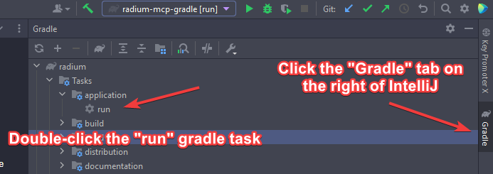

# Original radium client release
**NOTICE: I HAVE NO PLAINS TO UPDATE OR MAINTAIN THIS REPOSITORY!**

I decided to release the latest build of radium I could find. It's missing a lot of features, the codebase is terrible and a lot of things don't work properly. I believe this version is from around mid to late 2021. Credit to [Hexeption optifine sources mirror](https://github.com/Hexeption/Optifine-SRC) and purity for writing the hit marker sounds and some other minor things.

Videos of the client:
https://www.youtube.com/channel/UCRcJOqETKWtg5P5J3mB_oMw
## How to run
If you wish to just run the client the "versions" folder executable JAR and JSON are available on the [Releases page](https://github.com/nevalackin/original-radium/releases) under the latest tag (for example v1.4.0). If you would like to modify the source code or build from source clone this repository via:
```shell
git clone https://github.com/nevalackin/original-radium.git radium_original
```
The resulting `radium_original` folder is a gradle project that can opened with your favorite IDE i.e. IntelliJ. 

To run the client from inside IntelliJ run the "run" gradle task as shown below: 

## Disclaimer
Don't copyright strike this repository, its purpose is to stop the spreading of malware from source releases and "versions" folder executable JAR releases.